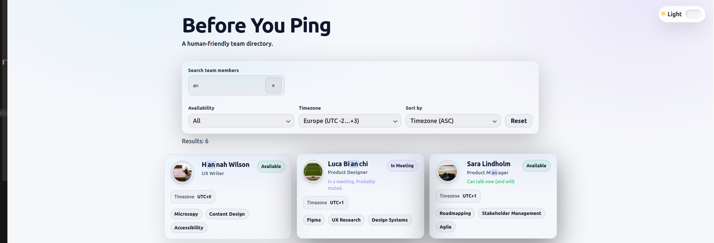
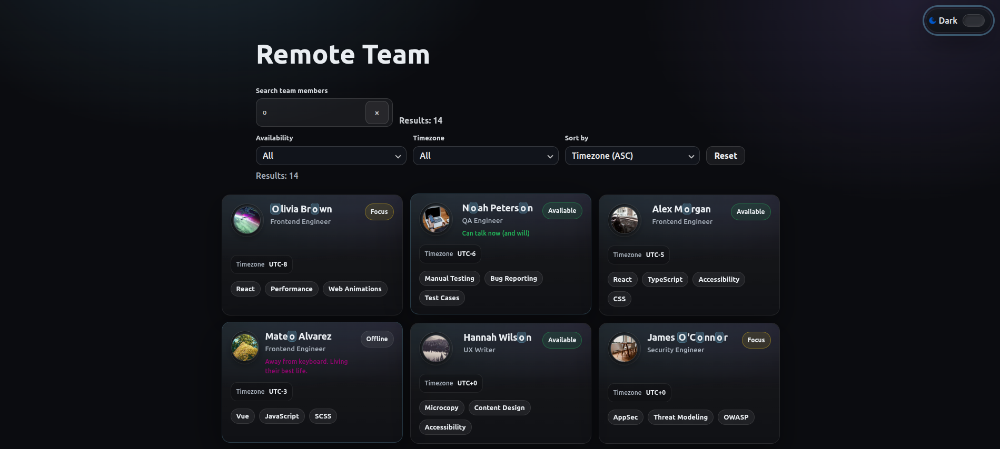

# Remote Team Directory

A small **React + TypeScript + Vite** project showcasing a modern, accessible UI
for browsing a distributed remote team. Focus: **clean UI architecture, design tokens, a11y, and polished micro-interactions**.

**Live demo:** https://taliacoruja.github.io/remote-team-directory/

---

## Preview

<p align="center">
  
  
</p>

---

## Features

- Responsive team grid with modern cards (avatar, status badge, skill chips)
- **Filters + sorting + search** (if applicable — list the exact ones you support)
- Dark / Light theme with system preference support
- Persistent theme selection (localStorage)
- Deterministic placeholder avatars + graceful fallback to initials
- Accessibility-first UI (semantic HTML, keyboard-friendly controls)

---

## What I focused on

- Clear UI layering (pages / entities / shared)
- Reusable UI primitives (Listbox, SearchInput, States)
- CSS design tokens via variables + theme switching via `data-theme`
- A11y basics done right: focus visibility, ARIA where needed, keyboard navigation

---

## Tech stack

- React 19
- TypeScript
- Vite
- CSS Modules + design tokens (CSS variables)
- ESLint

---

## Accessibility notes

- Semantic structure for cards and layout
- Decorative images use empty `alt`
- Keyboard-accessible controls (including the Listbox)
- Theme toggle exposes state via `aria-pressed`

---

## Getting started

```bash
npm install       # installs project dependencies
npm run dev       # start local dev server
npm run build     # type-check and build for production
npm run preview   # preview production build locally
npm run lint      # run ESLint